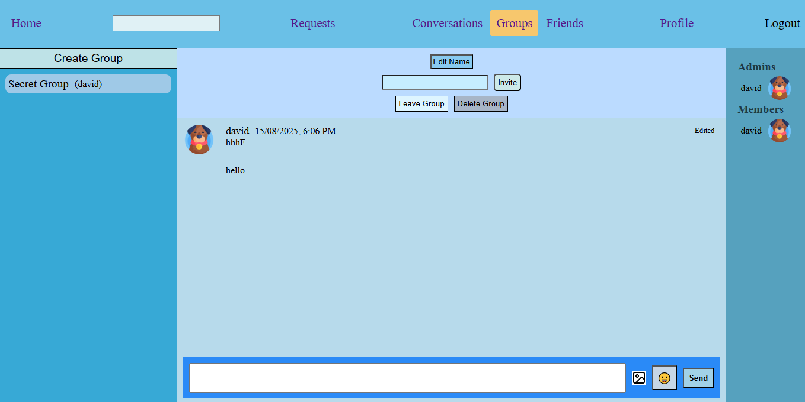

## Messaging App

Messaging App is a project for [The Odin Project](https://www.theodinproject.com/lessons/nodejs-messaging-app) built with Express and React. Messaging App where an user can send private messages to another or create groups and invite people into them to chat along.

Icons from https://www.flaticon.com  
backend https://github.com/John-Rashta/odin-message-api-backend  
App deployed [here](https://odin-message-api-frontend-production.up.railway.app/)

## Features
- **Authentication**
- **Private conversations**
- **Group Chats**

## TechStack

**Backend**:  
- **Node.js (TypeScript)**
- **Express**
- **Prisma**
- **PostgreSQL**  

**Frontend**:
- **React**
- **Vite**
- **React Router**
- **Redux + RTK Query**

**Deployment**:
- **Railway**
 
